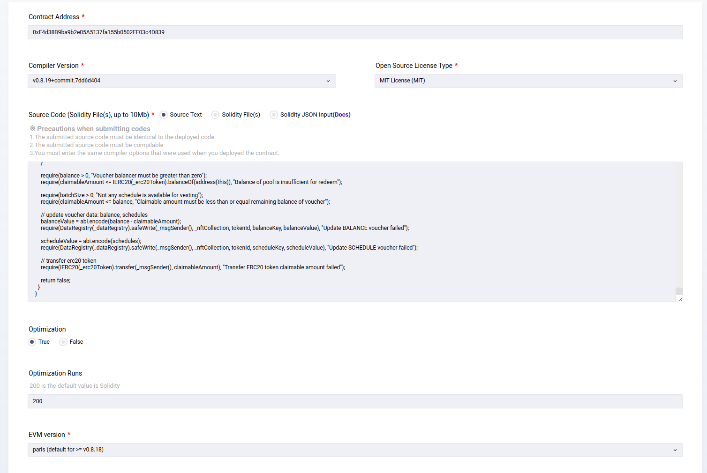
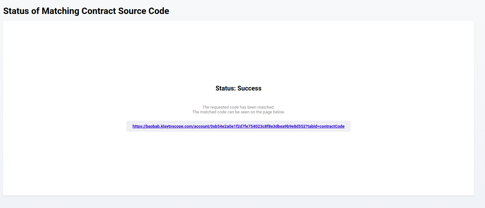
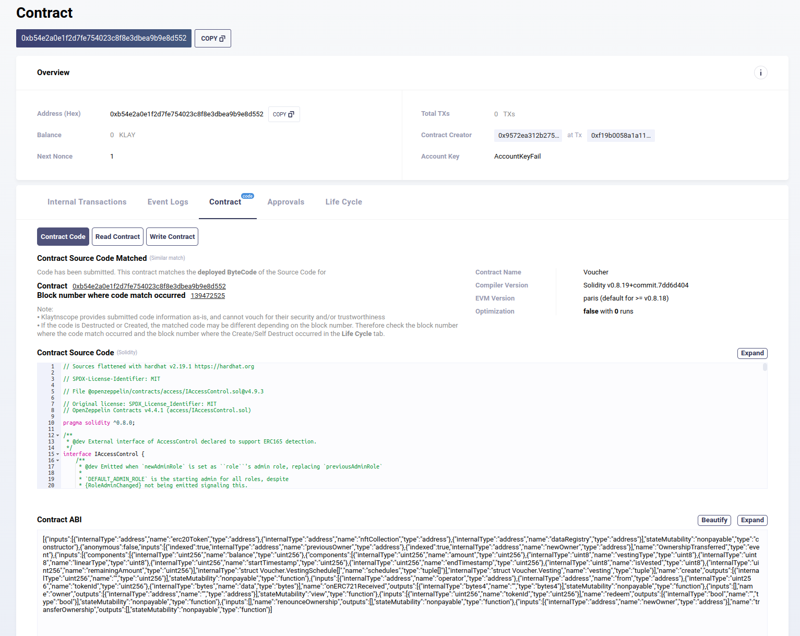

# Web3 Voucher
Smart contracts of Vesting-Voucher, the product which is applied for Klaytn Hackathon, Nov 2023.

## Prerequisites
* [NodeJS v16+](https://nodejs.org/en)
* [Hardhat v2.19](https://hardhat.org/)
* [OpenZeppelin v5](https://docs.openzeppelin.com/contracts/5.x/)

## Setup
* Install npm dependencies
```
$ npm install
```

* Create .env file from template
```
$ cp .env.example .env
```

* Fulfill credentials and secrets to .env file

## Compile
* Compile smart contracts
```
$ npx hardhat compile
```

## Test
* Execute Unit tests
```
$ npx hardhat test
```

* Generate coverage report
```
$ npx hardhat coverage
```

## Deploy in-memory and local node
* Deploy in-memory node (for testing purpose)
```
$ npx hardhat run ./scripts/deploy.ts
```

* Spin up local Hardhat node
```
$ npx hardhat node
```

* Deploy local Hardhat node
```
$ npx hardhat run ./scripts/deploy.ts --network localhost
```

## Deploy to real networks
* Add supported chain config to hardhat.config.ts
```
For example:
...
const config: HardhatUserConfig = {
  networks: {
    klaytn_testnet: {
      url: "https://api.baobab.klaytn.net:8651",
      chainId: 1001,      
      accounts: [privateKey]
    },
    ...
```

* Deploy command
```
$ npx hardhat run ./script/deploy.ts \
  --network <chain-name>
```

## Verify contract on KlaytnScope
* Unlike Etherscan or BSCscan, Klaytn explorer requires uploading smart contract source code to verify. Furthermore, the uploading source code must be the flatten source code of smart contract, hence each smart contract need to be flatten firstly, by following Hardhat command
```
$ npx hardhat flatten ./contracts/<Contract>.sol > ./flatten/<Flatten-Contract>.sol
```

* Open contract's page on KlaytnScope (the explorer of Klaytn networks), then go through following pages 
  - [Contract](https://baobab.klaytnscope.com/account/<contract-address>?tabId=contractCode) tab, select **Match contract source code**
  - Connect Wallet > Connect to Metamask wallet
  - Fulfill corresponding contract information
    - Contract address: *the deployed address*
    - Compiler version: *v0.8.19+*
    - Open source license type: *MIT licence*
    - Source code: copy/paste the flatten source code taken from previous step
    - Optimization: *True*
    - Optimization runs: *200*
    - EVM version: *paris*
    
  - Sign and submit > Wait for dozen of seconds for Klaytnscope to verify successfully 

* Upon successful verification, contract source code will be available on explorer, on Contract tab of detail page 

## Verify contract on BSCScan
* Obtain and fulfill BSCScan API key to .env file
```
export BSCSCAN_API_KEY="<API_KEY>"
```

* Verify contract, please remember to pass corresponding constructor arguments
```
For example:
$ npx hardhat verify --network bnb_testnet <voucher-deployed-address> <erc20-deployed-address> <nft-deployed-address> <dataregistry-deployed-address>
```

## Utils
* Create voucher
```
$ npx hardhat create --contract <voucher-address> \
  --balance <ethers-amount> \
  --schedules <json-encoded-vesting-schedules> \
  --network <network-name>
```
>  - *Prerequisites:* signer must approve voucher contract at least *ethers-amount* beforehand
>  - *IMPORTANT:* the vesting schedules is a json encoded string, with all amount values in Ethers unit, in order to avoid overflow while decoding, for example:
```
--schedules "[{\"amount\":\"1000000\",\"vestingType\":2,\"linearType\":0,\"startTimestamp\":1698828908,\"endTimestamp\":0,\"isVested\":0,\"remainingAmount\":\"0\"},{\"amount\":\"5000000\",\"vestingType\":1,\"linearType\":1,\"startTimestamp\":1700038508,\"endTimestamp\":1731660908,\"isVested\":0,\"remainingAmount\":\"5000000\"}]"
```

* Check smart contract code size, in order to avoid breaking limit 24KB
```
$ npx hardhat size-contracts
```

## License
Copyright belongs to Web3Voucher PTE. LTD, 2021-2023
